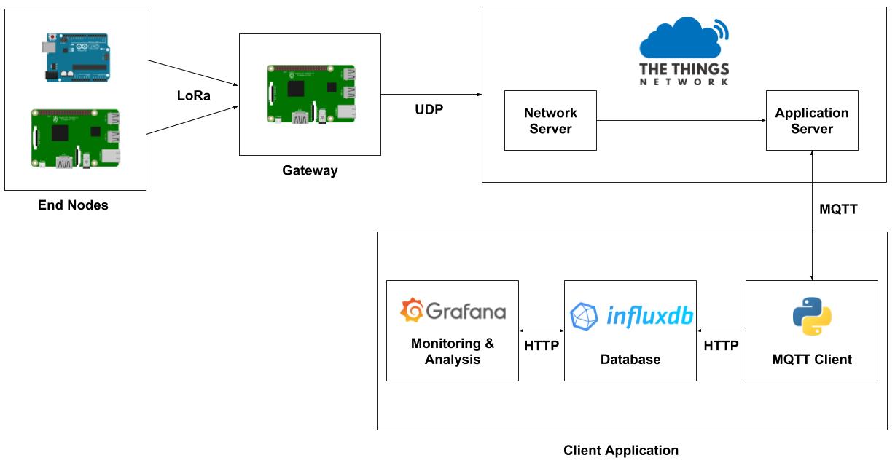

# LoRaWAN Python Interface for The Things Network

This repository contains the final project for the Internet of Things course. The aim of the project is to implement a single-channel packet-forwarder LoRaWAN gateway.

The majority of the work is resumed in the [project report](docs/report.pdf).

In order to build the gateway, we equipped a Raspberry Pi 3 B+ with a LoRa module; for testing and performance comparison purposes we used two different modules, one from Futura Elettronica and another one from Dragino.

The network and application server used by our gateway are both provided by The Things Network, to which we also connected an MQTT client application which receives and stores the data in a time-series database and plots them for further analysis.

The results obtained with the two LoRa modules are equivalent, and they more or less matched the performance capabilities claimed by the LoRa technology.

The main purpose of this work is to put in practice the technologies seen during the IoT course, and also to contribute to the LoRaWAN network diffusion in the Bologna Area.

Here is an overview of our implementation:

